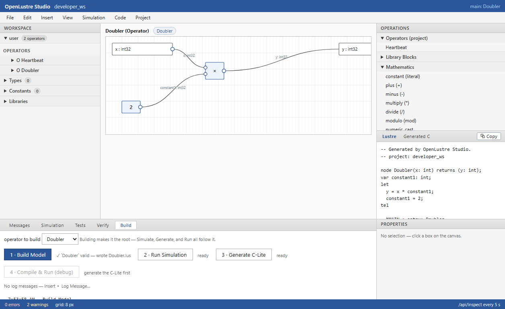
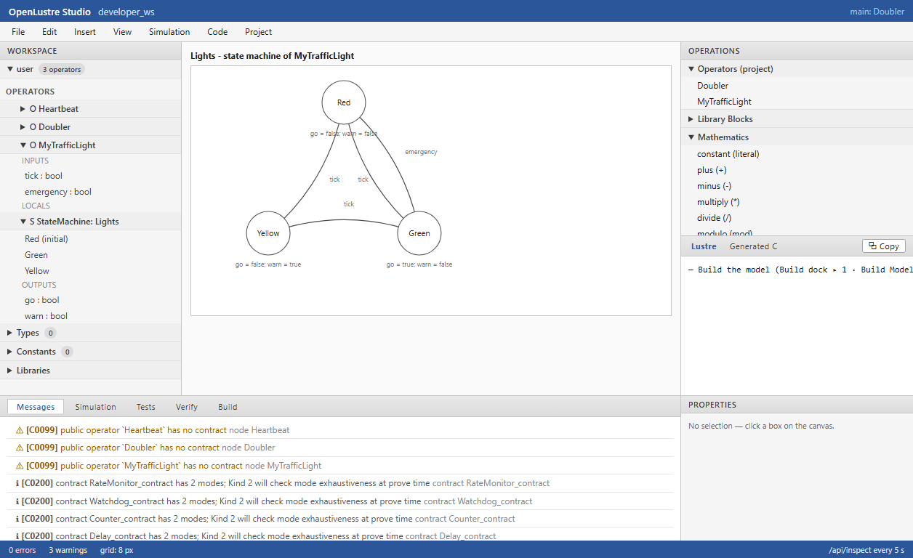
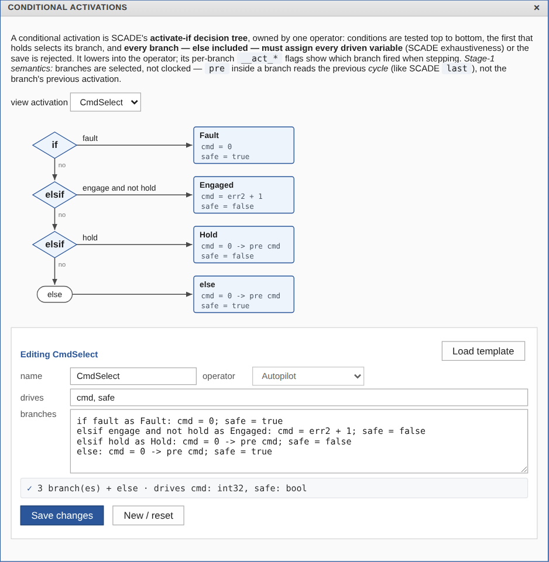
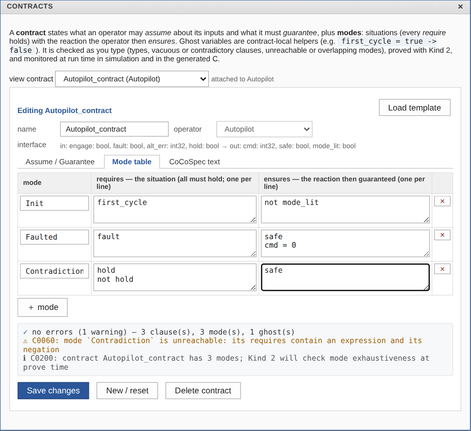
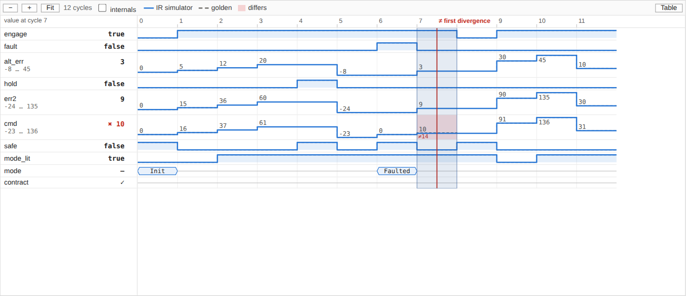
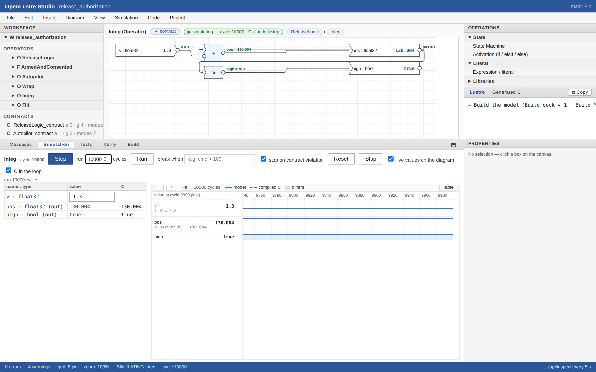
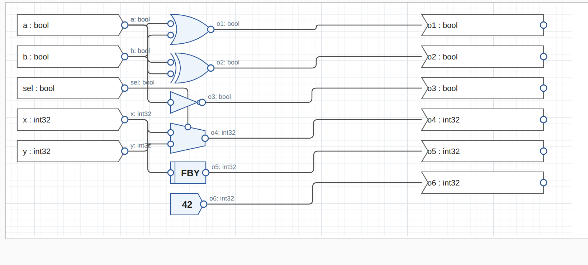

# OpenLustre Studio

**An open-source, SCADE-like graphical modeling IDE for safety-critical
embedded software.** Engineers graphically design synchronous models —
dataflow blocks, if/then/else logic, state machines, math, mode-aware
CoCoSpec contracts — whose native storage and semantics are
**Lustre**. The selected root operator, and everything it transitively
uses, is auto-generated into **Directional C-Lite** that compiles and
provably behaves identically to the simulated model.

OpenLustre Studio is **not a SCADE replacement**. It is a similar
models-to-source-code capability — open, scriptable, and verifiable —
for teams that want the SCADE workflow shape (draw → check → simulate →
generate → test → prove) without a qualified-tool license, or as a
front-of-pipeline workbench before downstream SCADE / qualified
code-generation flows.

```text
The model is not just equations.
The model is equations + contracts + modes + evidence.
```

## A look at the Studio

`openlustre studio launch` opens a SCADE-style docked workbench in your
browser: a Project Explorer, a dataflow canvas with a block palette, the
generated Lustre / C side panes, stepped simulation, a gated build pipeline,
and the tests/verify docks.

**Dataflow modeling.** Operators are drawn as wired blocks; the model's native
storage and semantics are Lustre, generated and shown live beside the diagram.



**State machines, owned by an operator.** SCADE-style automata are authored
nested under the operator they drive — the project tree expands into
Inputs / Locals / StateMachine / Outputs — and every output is checked for
exhaustive per-state coverage. The same machine is shown as a state chart:
its initial state (ringed), guarded transitions, and per-state outputs.



**Conditional activation (activate-if).** SCADE's `if` / `elsif` / `else`
decision tree, owned by an operator like a state machine: the first
condition that holds selects its branch, and every branch — else included —
must assign every driven variable, checked before the tree is saved. It is
drawn as a decision-tree chart, and on the operator's canvas both constructs
appear as single blocks (reads in, drives out; double-click to edit). When
stepping, per-branch flags show which branch fired each cycle.



**Contracts, authored in the Studio.** Each operator can carry a CoCoSpec
contract — ghost variables, assumptions, guarantees and modes — edited as
clause rows, as a SCADE-style **mode table** (situation → reaction), or as
CoCoSpec text. Every edit is checked live (types, vacuous or contradictory
clauses, unreachable or overlapping modes) with the offending rows
outlined, and the contract's interface follows the operator's ports. The
same contract is proved with Kind 2 and monitored at run time: each
contract compiles to an observer node that the simulator steps and the
generated C runs, so `pre`/`->` and ghost variables behave identically in
both.



**Live simulation, on the diagram.** Build ▸ Simulate starts a simulation
session that the server keeps open: each Step runs exactly one more cycle
(no replay from cycle 0), *Run N* runs a batch, and a run stops early at a
**breakpoint condition** (`cmd > 80`, any stateless expression over the
operator's signals) or at the first contract violation. While the session
runs, the canvas shows every wire's current value, input and output blocks
carry value badges, the active state machine state and the activation
branch that fired are highlighted — on the canvas blocks and in their chart
dialogs — and the contract chip names the active modes with a ✓ or the
violated clauses. Editing the model marks the session stale; the next Step
restarts it on the edited model.


**Waveforms.** Every signal of the session is drawn as a lane over cycles:
Booleans as digital traces, numbers as stepped analog traces, enums and
contract modes as bus segments, and the contract check as a red/clear status
lane, with breakpoint and violation stops marked on the time axis. The name
column is a readout of every value at the hovered cycle. Click a cycle (or
walk with ←/→) to **review** it: the diagram, state charts, activation
trees and contract chip all show that cycle until you step again. The same
viewer opens a test scenario against its golden trace (the golden dashed
underneath, every differing cell banded red with the expected value, the
first divergence marked) and a Kind 2 counterexample (the falsifying cycle
marked). Both can be **replayed in the simulator**, which then keeps
stepping from where they end.




**C in the loop.** Tick *C in the loop* and the Studio compiles the
simulated operator's generated C and steps it in lockstep with the model:
the same inputs each cycle, the outputs and contract-monitor columns
compared as they come. The compiled C's values are drawn as the waveform's
reference lanes, the watch table gets a C column, a disagreeing output shows
"≠ C value" on the diagram, and a Run stops at the first cycle where model
and code part. Attaching mid-run replays the session so far through the C
first. On its first runs it caught three real model-vs-code differences,
all since fixed: sized integers didn't wrap on assignment, enum inputs were
rejected, and `float32` was simulated in double precision (a long-running
integrator drifted from the C after ~950 cycles).

**Reals behave as in the generated C.** `float32` computes in single
precision (`float op float` stays `float`), a `float64` operand or a real
literal (always emitted as a C double literal) promotes to `double`, a
conditional takes its branches' common type as C's `?:` does, and storing,
passing an argument or reading an input converts to the declared type.
Model and C traces print reals with the same shortest round-trip algorithm,
so they match byte for byte — the integrator above now runs 10 000 cycles
in lockstep and reads 130.004 on both sides (single-precision drift,
modelled rather than hidden).



Where the Studio stands against the project's goals, and what comes next, is
tracked in [docs/scade-parity-roadmap.md](docs/scade-parity-roadmap.md).

**SCADE-style drafting.** Predefined operators draw as real glyphs — MIL-shape
AND/OR/XOR gates, the NOT triangle, the if/then/else selector trapezoid with
its condition pin on the sloped top edge, temporal blocks (`pre`, `FBY`) with
a state bar, pointed literal tags — while inputs and outputs are
flow-direction pennants and wires run orthogonally with rounded corners,
annotated at their source pin. The canvas zooms (Ctrl+wheel about the cursor,
zoom-to-fit, 100%), pans with middle-drag, rubber-band multi-selects, drags
whole selections, nudges with the arrow keys, aligns and distributes through
the Diagram menu, copies/pastes selections across operators (fresh names,
intra-group wiring kept), carries a minimap overview, and exports the diagram
as SVG or PNG. State charts are draggable too — arrange a machine's states
and the layout persists into the model file.



## Installing

**Windows** — download `OpenLustreStudio-<version>-Setup.exe` from the
releases page and run it. You get a normal install wizard, a Start Menu
entry, and an optional Desktop shortcut; double-clicking the shortcut runs
`openlustre studio launch`, which starts the Studio and opens your browser
on a welcome project (created at `%USERPROFILE%\OpenLustre` on first run).
The 41-block standard library is embedded in the binary — nothing else to
install. (Installer built from `packaging/windows/openlustre.iss`; the
`release` GitHub Actions workflow produces it on every version tag.)

**Linux / macOS** — grab the release archive (or `cargo build --release
-p ol_cli`), then `./packaging/linux/install.sh` to get the binary in
`~/.local/bin` plus an application-menu shortcut, or just run:

```bash
openlustre studio launch        # starts the Studio + opens your browser
```

## The workflow

```bash
# 1. Open the Studio in a browser (the embedded block library loads
#    automatically; --with-stdlib DIR overrides it for development):
openlustre studio launch model.json
#    → Project Explorer, dataflow Diagram, Edit forms (create operators,
#      ports, equations with if/math/temporal ops and a 41-block library
#      palette), SCADE-style Step tab (deterministic value for EVERY item,
#      every cycle), Tests tab, generated Lustre + C-Lite views, Build tab.

# 2. Check the model (types, clocks, contracts, modes):
openlustre check model.json --with-stdlib libraries

# 3. Simulate (batch or stepped; full traces carry every signal):
openlustre simulate model.json --inputs scenario.csv --with-stdlib libraries

# 4. Generate C for the SELECTED operator and all that it uses (SCADE KCG
#    behavior — nothing unused leaks into the generated source):
openlustre emit-clite model.json --root MyOperator --with-stdlib libraries \
    --out build/ --driver
cd build/clite && make        # → standalone executable named after the
                              #   user-designated main operator

# 5. Verify model ↔ generated C equivalence with golden-trace scenarios:
openlustre test record model.json --scenarios scenarios/
openlustre test run    model.json --scenarios scenarios/ --backend both
# [PASS] nominal (ir)   [PASS] nominal (c)   ← byte-identical traces, CI-ready

# 6. Prove properties with Kind 2 (counterexamples as per-cycle waveforms):
openlustre prove model.json --timeout 30 --waveform
```

## What makes it OpenLustre (differences from SCADE)

* **User-defined entry point** — any operator can be designated `main`;
  the generated build produces a standalone executable named after it.
  (SCADE fixes the runtime shape; OpenLustre lets the model own `main`.)
* **Contracts are first-class** — CoCoSpec assume/guarantee/mode clauses,
  authored in the Studio's contract editor,
  live beside the equations, are checked statically (vacuity,
  unreachable modes, import signatures), monitored at runtime in both
  the simulator and the generated C, and proved with Kind 2.
* **Everything is a CLI command** — the GUI shells the same commands, so
  every panel action is scriptable and CI-able.

## Repository layout

```text
crates/
  ol_ir              strict dataflow + state-machine IR, project slicer
  ol_contract_ir     CoCoSpec contract IR
  ol_typecheck       types, records/enums/arrays, no-implicit-narrowing
  ol_contract_check  contract well-formedness + vacuity/unreachability
  ol_lustre_emit     Lustre emitter (Kind 2-compatible)
  ol_cocospec_emit   contract emitter (modern con/noc + legacy)
  ol_clite_emit      Directional C-Lite + monitors + drivers + Makefile
  ol_sim             cycle-accurate IR interpreter (full-trace stepping)
  ol_kind2           Kind 2 adapter (timeout, property selection, waveforms)
  ol_stdlib          41-block library loader (logic/math/temporal/safety/
                     observer/bits/avionics/state-machine categories)
  ol_cli             the `openlustre` binary: every command + Studio server
libraries/           the standard block library (YAML, contract-carrying)
examples/            ReleaseLogic MVP with committed golden-trace scenarios
apps/studio_ui/      GUI architecture notes (browser SPA ships in the binary)
```

## Verification spine

The repository's tests enforce the load-bearing invariant end to end:
**the IR simulator and the compiled generated C produce byte-identical
traces** — across stateful operators, state machines, compound types,
bit manipulation, constants, contract monitors, and user scenarios.
`openlustre test run --backend both` puts that same invariant in users'
hands for their own models.
