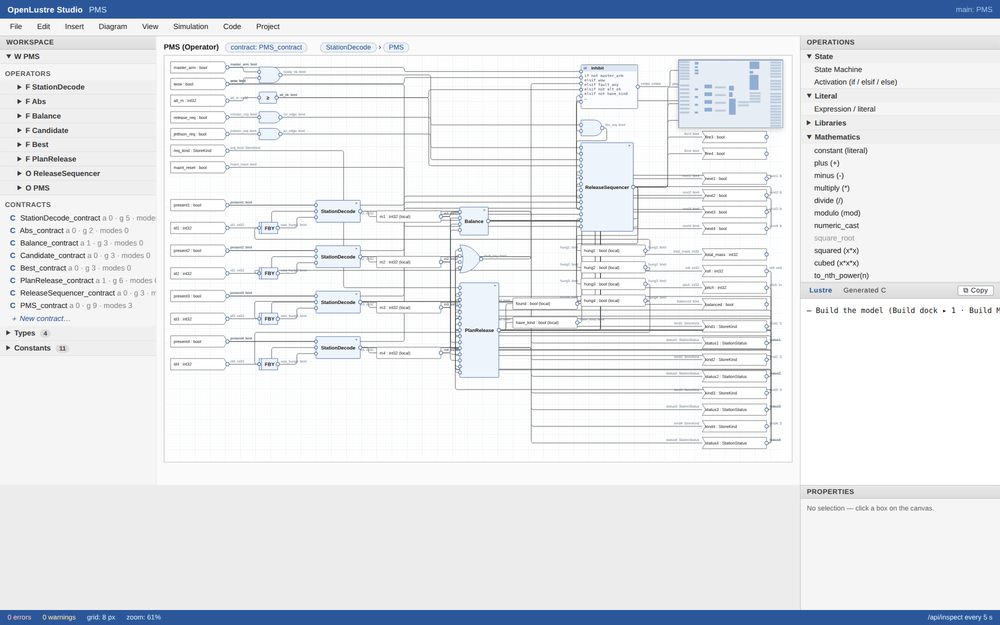

# OpenLustre Studio

Local reusable projects can opt into the [native `.olproj` manifest format](docs/native-projects.md)
for explicit exports, aliases, exact snapshots and qualified symbols. This
increment uses a read-only native Studio view; see the format's documented
scope and regression evidence before designing an embedded project around it.

**An open-source, SCADE-like graphical modeling IDE for safety-critical
embedded software.** Engineers graphically design synchronous models —
dataflow blocks, if/then/else logic, state machines, math, mode-aware
CoCoSpec contracts — whose native storage and semantics are
**Lustre**. The selected root operator, and everything it transitively
uses, is auto-generated into **Directional C-Lite** that compiles and
provably behaves identically to the simulated model.

OpenLustre Studio is **not a SCADE replacement** and not a certified
tool: it is for **demonstration and prototyping**. It is a similar
models-to-source-code capability — open, free (Apache-2.0), scriptable,
and verifiable — for teams that want the SCADE workflow shape (draw →
check → simulate → generate → test → prove) before they have a SCADE
license: a way to work while waiting for Ansys SCADE. Models are Lustre,
SCADE's own foundation, and translating them into SCADE projects is on
the roadmap, so the work carries over when SCADE arrives. Runs on
Windows, Ubuntu Linux and macOS.

```text
The model is not just equations.
The model is equations + contracts + modes + evidence.
```

## A look at the Studio

`openlustre studio launch` opens a SCADE-style docked workbench in your
browser: a Project Explorer, a dataflow canvas with a block palette, the
generated Lustre / C side panes, stepped simulation, a gated build pipeline,
and the tests/verify docks.

**Dataflow modeling.** Operators are drawn as wired blocks; the model's native
storage and semantics are Lustre, generated and shown live beside the diagram.


**State machines, owned by an operator.** SCADE-style automata are authored
nested under the operator they drive — the project tree expands into
Inputs / Locals / StateMachine / Outputs — and every output is checked for
exhaustive per-state coverage. The same machine is shown as a state chart:
its initial state (ringed), guarded transitions, and per-state outputs.


**Conditional activation (activate-if).** SCADE's `if` / `elsif` / `else`
decision tree, owned by an operator like a state machine: the first
condition that holds selects its branch, and every branch — else included —
must assign every driven variable, checked before the tree is saved. It is
drawn as a decision-tree chart, and on the operator's canvas both constructs
appear as single blocks (reads in, drives out; double-click to edit). When
stepping, per-branch flags show which branch fired each cycle. Branches are
**clocked**, as in SCADE: a branch runs only on the cycles it is selected
and its state is frozen otherwise — `pre v` inside a branch is `v` at the
branch's previous activation, `->` initializes on its first activation, and
a called operator steps only while its branch runs. `last(v)` (SCADE's
`last 'v`) reads the previous cycle's value whichever branch set it — the
"hold" pattern, e.g. `else: cmd = last(cmd)`. Activations lower onto
`when` / `merge` clocks, so the simulator, the generated C and the Lustre
given to Kind 2 all share one semantics.


**Contracts, authored in the Studio.** Each operator can carry a CoCoSpec
contract — ghost variables, assumptions, guarantees and modes — edited as
clause rows, as a SCADE-style **mode table** (situation → reaction), or as
CoCoSpec text. Every edit is checked live (types, vacuous or contradictory
clauses, unreachable or overlapping modes) with the offending rows
outlined, and the contract's interface follows the operator's ports. The
same contract is proved with Kind 2 and monitored at run time: each
contract compiles to an observer node that the simulator steps and the
generated C runs, so `pre`/`->` and ghost variables behave identically in
both.


**Live simulation, on the diagram.** Build ▸ Simulate starts a simulation
session that the server keeps open: each Step runs exactly one more cycle
(no replay from cycle 0), *Run N* runs a batch, and a run stops early at a
**breakpoint condition** (`cmd > 80`, any stateless expression over the
operator's signals) or at the first contract violation. While the session
runs, the canvas shows every wire's current value, input and output blocks
carry value badges, the active state machine state and the activation
branch that fired are highlighted — on the canvas blocks and in their chart
dialogs — and the contract chip names the active modes with a ✓ or the
violated clauses. Editing the model marks the session stale; the next Step
restarts it on the edited model.


**Waveforms.** Every signal of the session is drawn as a lane over cycles:
Booleans as digital traces, numbers as stepped analog traces, enums and
contract modes as bus segments, and the contract check as a red/clear status
lane, with breakpoint and violation stops marked on the time axis. The name
column is a readout of every value at the hovered cycle. Click a cycle (or
walk with ←/→) to **review** it: the diagram, state charts, activation
trees and contract chip all show that cycle until you step again. The same
viewer opens a test scenario against its golden trace (the golden dashed
underneath, every differing cell banded red with the expected value, the
first divergence marked) and a Kind 2 counterexample (the falsifying cycle
marked). Both can be **replayed in the simulator**, which then keeps
stepping from where they end.


**C in the loop.** Tick *C in the loop* and the Studio compiles the
simulated operator's generated C and steps it in lockstep with the model:
the same inputs each cycle, the outputs and contract-monitor columns
compared as they come. The compiled C's values are drawn as the waveform's
reference lanes, the watch table gets a C column, a disagreeing output shows
"≠ C value" on the diagram, and a Run stops at the first cycle where model
and code part. Attaching mid-run replays the session so far through the C
first. On its first runs it caught three real model-vs-code differences,
all since fixed: sized integers didn't wrap on assignment, enum inputs were
rejected, and `float32` was simulated in double precision (a long-running
integrator drifted from the C after ~950 cycles).

**Reals behave as in the generated C.** `float32` computes in single
precision (`float op float` stays `float`), a `float64` operand or a real
literal (always emitted as a C double literal) promotes to `double`, a
conditional takes its branches' common type as C's `?:` does, and storing,
passing an argument or reading an input converts to the declared type.
Model and C traces print reals with the same shortest round-trip algorithm,
so they match byte for byte — the integrator above now runs 10 000 cycles
in lockstep and reads 130.004 on both sides (single-precision drift,
modelled rather than hidden).


**Model-to-code traceability.** Every equation in the generated C is
preceded by a one-line `@trace` comment naming its operator, its diagram
element (`eq3`, `sm:ModeLamp`, `act:CmdSelect`), what it is when lowered
from a construct (`activation CmdSelect, branch Engaged computes cmd`) and
the equation in model syntax. In the Studio's Generated C pane, click a
traced line to open its operator with the element selected; select a block,
a construct or a variable on the canvas to highlight the C it generates.
**Code ▸ Generation Report** lists every generated file with its SHA-256,
each operator's interface, step function and state, and the traceability
coverage (every equation, or which aren't); `emit-clite` writes the same
report (`generation_report.md` / `.json`) and the machine-readable trace
matrix (`trace.json`: each equation's element, origin, source and line
range) next to the sources.


**Evidence report.** One document per operator gathers what the tool chain
can show about it: static checks (types, clocks, contracts), the contract
in CoCoSpec, the Kind 2 proof, the recorded scenarios with decision and
MC/DC coverage, the compiled generated C checked against the model cycle by
cycle (with the compiler's identity and flags), and model-to-code
traceability with every generated file's SHA-256 — plus the model files'
SHA-256 and a layout-independent fingerprint of the operator, so the
evidence names exactly what it covers. Each section is *pass*, *gaps*,
*fail* or *not run*; the verdict is FAIL if any section fails, PASS WITH
GAPS if any is incomplete. **Project ▸ Evidence Report…** shows it and
opens the full page (print it to PDF); `openlustre evidence` writes the
HTML and JSON and exits non-zero on FAIL, so CI can gate on it.


**Proving with Kind 2.** The Verify dock proves the root operator's
contract with Kind 2: every guarantee and mode ensure, plus the mode checks
(each mode reachable, some mode always active), each shown with its clause
and result; **Realizability** asks whether any implementation could meet the
guarantees, with the conflicting clauses when none can; **Mode coverage**
runs the mode checks alone. A counterexample opens on the waveform viewer
and replays in the simulator. What Kind 2 reads is a faithful view of the
model, not a best effort: contracts are imported in node headers, clocked
equations (and so activations) are rewritten onto the base clock with the
same hold semantics the simulator and the C execute — checked against the
clocked original cycle by cycle — and integer division, remainder and casts
go through helpers that behave as in C (Kind 2's own are Euclidean and
floor). The proof states what it assumes (exact reals, the root's inputs
within their types).

**Proving over machine integers.** Kind 2 reasons about mathematical
integers; the generated C computes in `int8_t`…`uint64_t`. **Prove** closes
that gap with runtime-error checks, proved alongside the contract in the
context of the root: every integer operation fits the type C computes it in
(`a + b` on two `int8` is computed in `int` and cannot overflow; `p * q` on
two `int32` can), a narrow value stored back (`s: int8 = a + b`) fits, no
division by zero, every index in bounds, every real-to-integer conversion in
range. A check in a called operator is proved for each call instance — for
the inputs the caller can actually give it — and reported with its path
(`overflow in PlanRelease#1 › Candidate#3: roll - droll fits int32`) in the Verify dock's **Runtime errors** group, the CLI and the
evidence report. A counter left to run forever is reported (Kind 2 cannot
settle `pre n + 1` before the timeout); saturate it and it is proved.
`openlustre prove --no-runtime-errors` (or the dock's checkbox) proves the
contracts alone.

Kind 2 and an SMT solver are found wherever they are — `OPENLUSTRE_KIND2` /
`OPENLUSTRE_Z3`, the per-user tools folder, next to the `openlustre` binary
(Linux and macOS release archives bundle both), or `PATH`.
`openlustre kind2 doctor` says what it found and proves a sample property;
`openlustre kind2 install` (or **Install** in the Studio's Kind 2 dialog)
downloads the pinned Kind 2 v2.2.0 and Z3 4.13.4 on Linux and macOS. Kind 2
has no Windows build: use WSL or Docker through `tools/kind2-wsl.cmd` or
`tools/kind2-docker.sh`. CI installs the pair and proves every example.


**A complete example: the PMS.** [`examples/pms`](examples/pms) is a
Payload Management System for a drone, built in the Studio from an
[implementation plan](examples/pms/PLAN.md). It identifies the store on each
of four hooks, plans releases that keep the vehicle balanced (single hooks or
lateral pairs, refusing what would unbalance it), and drops stores on
command behind arming, airborne and altitude interlocks. It has a release
sequencer state machine, an inhibit decision tree, and a contract on every
operator. Its evidence report is a clean PASS: 171 of 171 properties proved
by Kind 2 — among them 60 runtime-error checks, so no moment, sum or counter
can overflow `int32` however long it flies — 8 scenarios passing on the model
and the generated C with MC/DC 151/151, and every generated equation traced.
Its generated C runs in a 100 Hz cyclic task against a scripted 50 s mission
(`examples/pms/integration`). The PMS is a project of its own, developed in
its own repository: it pins the OpenLustre Studio version it is built with,
installs and verifies itself, and has its own CI. `examples/pms` is a
snapshot of it (`tools/sync-pms.sh` refreshes it), shipped as the sample in
every download and used here as a regression test.



Where the Studio stands against the project's goals, and what comes next, is
tracked in [docs/scade-parity-roadmap.md](docs/scade-parity-roadmap.md).

**SCADE-style drafting.** Predefined operators draw as real glyphs — MIL-shape
AND/OR/XOR gates, the NOT triangle, the if/then/else selector trapezoid with
its condition pin on the sloped top edge, temporal blocks (`pre`, `FBY`) with
a state bar, pointed literal tags — while inputs and outputs are
flow-direction pennants and wires run orthogonally with rounded corners,
annotated at their source pin. The canvas zooms (Ctrl+wheel about the cursor,
zoom-to-fit, 100%), pans with middle-drag, rubber-band multi-selects, drags
whole selections, nudges with the arrow keys, aligns and distributes through
the Diagram menu, copies/pastes selections across operators (fresh names,
intra-group wiring kept), carries a minimap overview, and exports the diagram
as SVG or PNG. State charts are draggable too — arrange a machine's states
and the layout persists into the model file.


## Installing

Each OS has its own download, with an installer (from the repository's
Releases page, or from the latest run of the **package** workflow under
Actions ▸ package ▸ Artifacts):

| OS | Installer | Or |
|---|---|---|
| **Windows** 10/11, x64 | `OpenLustreStudio-<v>-windows-x86_64-Setup.exe` — a setup wizard; installs for you (no admin rights) or for everyone, adds Start Menu shortcuts and, optionally, `openlustre` to PATH; uninstall from Settings ▸ Apps | `…-windows-x86_64.zip`: portable, unzip and run |
| **Ubuntu** 22.04+ (and Debian-based), x64 | `openlustre-studio_<v>_amd64.deb` — `sudo apt install ./openlustre-studio_<v>_amd64.deb` | `…-linux-x86_64.tar.gz`: unpack, `./install.sh` (per user; `--system` for everyone; `--uninstall`) |
| **macOS** 13+, Apple Silicon | `…-macos-arm64.pkg` — double-click (the download is not signed: right-click ▸ Open the first time) | `…-macos-arm64.tar.gz`: unpack, `./install.sh` |
| **macOS** 13+, Intel | `…-macos-x86_64.pkg` | `…-macos-x86_64.tar.gz` |

Every download carries the Studio, the 41-block library, and the samples;
the Linux and macOS ones also bundle the Kind 2 prover and Z3, so proving
works out of the box (`openlustre kind2 doctor` checks). Kind 2 has no
Windows build: on Windows it runs through WSL or Docker
(`README-windows.txt` in the install folder). Generating and testing C
needs a C compiler (gcc or clang; on Windows MSVC Build Tools or MinGW).

Start **OpenLustre Studio** or **OpenLustre Studio — PMS sample** from the
Start Menu, the application menu, or Applications ▸ OpenLustre Studio: the
Studio opens in your browser, with its log in a console window (close it to
stop the Studio). From a terminal:

```bash
openlustre studio launch                 # a welcome project in ~/OpenLustre
openlustre studio launch --sample pms    # the Payload Management System sample
```

To build the downloads yourself: `packaging/linux/build.sh <version>`,
`packaging/macos/build.sh <version> <aarch64|x86_64>`, or
`packaging\windows\build-installer.ps1 -Version <version>`; each OS has a
`smoke` script that installs the result and checks it.

## The workflow

```bash
# 1. Open the Studio in a browser (the embedded block library loads
#    automatically; --with-stdlib DIR overrides it for development):
openlustre studio launch model.json
#    → Project Explorer, dataflow Diagram, Edit forms (create operators,
#      ports, equations with if/math/temporal ops and a 41-block library
#      palette), SCADE-style Step tab (deterministic value for EVERY item,
#      every cycle), Tests tab, generated Lustre + C-Lite views, Build tab.

# 2. Check the model (types, clocks, contracts, modes):
openlustre check model.json --with-stdlib libraries

# 3. Simulate (batch or stepped; full traces carry every signal):
openlustre simulate model.json --inputs scenario.csv --with-stdlib libraries

# 4. Generate C for the SELECTED operator and all that it uses (SCADE KCG
#    behavior — nothing unused leaks into the generated source):
openlustre emit-clite model.json --root MyOperator --with-stdlib libraries \
    --out build/ --driver
cd build/clite && make        # → standalone executable named after the
                              #   user-designated main operator
# build/trace.json             — every equation → diagram element + C lines
# build/generation_report.md   — files (SHA-256), operators, state, coverage

# 5. Verify model ↔ generated C equivalence with golden-trace scenarios:
openlustre test record model.json --scenarios scenarios/
openlustre test run    model.json --scenarios scenarios/ --backend both
# [PASS] nominal (ir)   [PASS] nominal (c)   ← byte-identical traces, CI-ready

# 6. Prove properties with Kind 2 (counterexamples as per-cycle waveforms;
#    exits non-zero unless every property holds). Set Kind 2 up once:
openlustre kind2 install      # Linux/macOS: Kind 2 + Z3 into ~/.openlustre/tools
openlustre kind2 doctor       # what was found, and a sample proof
openlustre prove model.json --timeout 30 --waveform
openlustre prove model.json --mode realizability

# 7. The evidence report for an operator — checks, contract, proof, tests
#    and coverage, model ≡ C, traceability — as HTML + JSON; fails on FAIL:
openlustre evidence model.json --root MyOperator --scenarios scenarios/ \
    --prove --out evidence/
```

## What makes it OpenLustre (differences from SCADE)

* **User-defined entry point** — any operator can be designated `main`;
  the generated build produces a standalone executable named after it.
  (SCADE fixes the runtime shape; OpenLustre lets the model own `main`.)
* **Contracts are first-class** — CoCoSpec assume/guarantee/mode clauses,
  authored in the Studio's contract editor,
  live beside the equations, are checked statically (vacuity,
  unreachable modes, import signatures), monitored at runtime in both
  the simulator and the generated C, and proved with Kind 2.
* **Everything is a CLI command** — the GUI shells the same commands, so
  every panel action is scriptable and CI-able.

## Repository layout

```text
crates/
  ol_ir              strict dataflow + state-machine IR, project slicer
  ol_contract_ir     CoCoSpec contract IR
  ol_typecheck       types, records/enums/arrays, no-implicit-narrowing
  ol_contract_check  contract well-formedness + vacuity/unreachability
  ol_lustre_emit     Lustre emitter (readable projection)
  ol_cocospec_emit   contract emitter + the Kind 2 view (one faithful file)
  ol_clite_emit      Directional C-Lite + monitors + drivers + Makefile
  ol_sim             cycle-accurate IR interpreter (full-trace stepping)
  ol_kind2           Kind 2 adapter (v2 JSON, realizability, waveforms)
  ol_stdlib          41-block library loader (logic/math/temporal/safety/
                     observer/bits/avionics/state-machine categories)
  ol_cli             the `openlustre` binary: every command + Studio server
libraries/           the standard block library (YAML, contract-carrying)
examples/            ReleaseLogic MVP; PMS, a complete drone payload
                     management system (plan, model, scenarios, proofs)
tools/               prove-examples.sh (CI), Kind 2 WSL / Docker wrappers, sync-pms.sh
apps/studio_ui/      GUI architecture notes (browser SPA ships in the binary)
```

## Verification spine

The repository's tests enforce the load-bearing invariant end to end:
**the IR simulator and the compiled generated C produce byte-identical
traces** — across stateful operators, state machines, compound types,
bit manipulation, constants, contract monitors, and user scenarios.
`openlustre test run --backend both` puts that same invariant in users'
hands for their own models.
