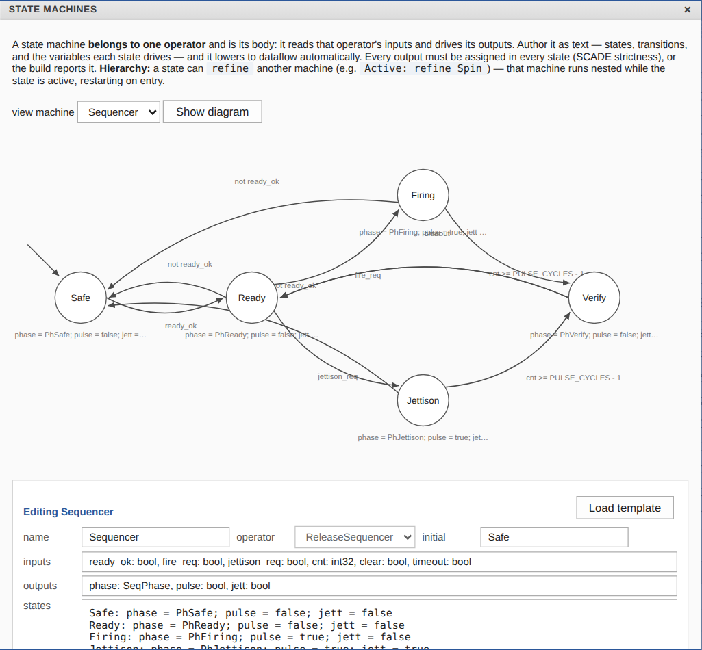
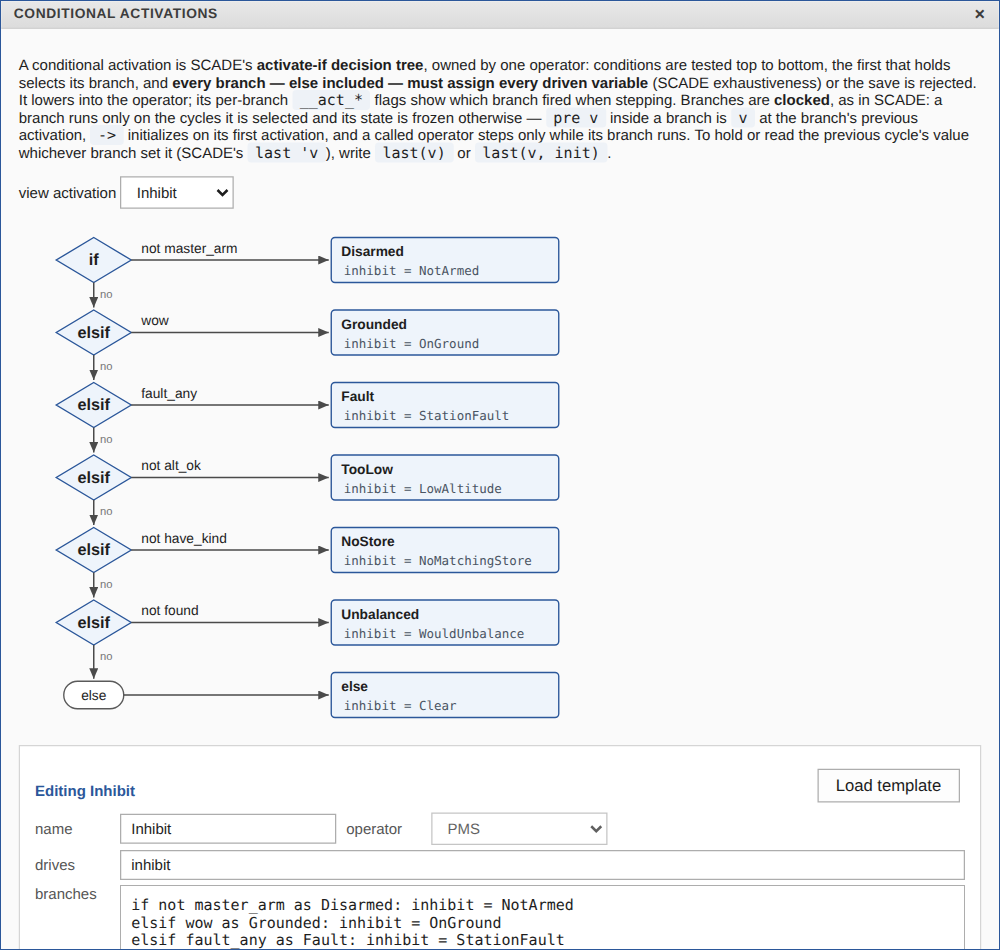
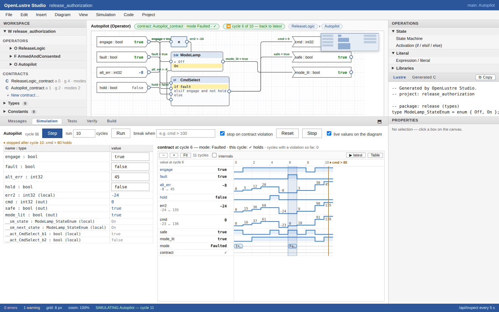
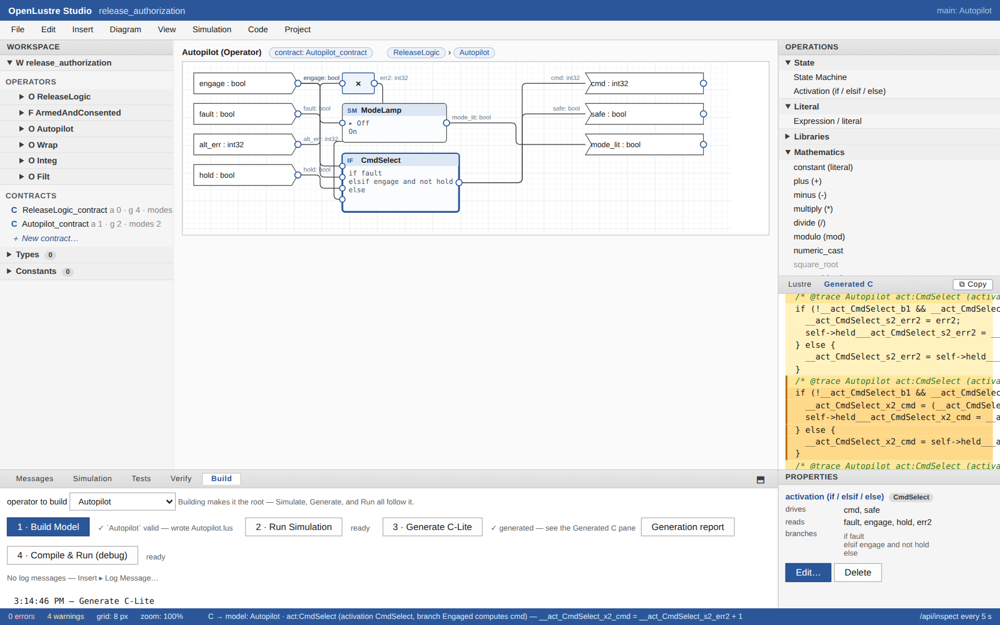
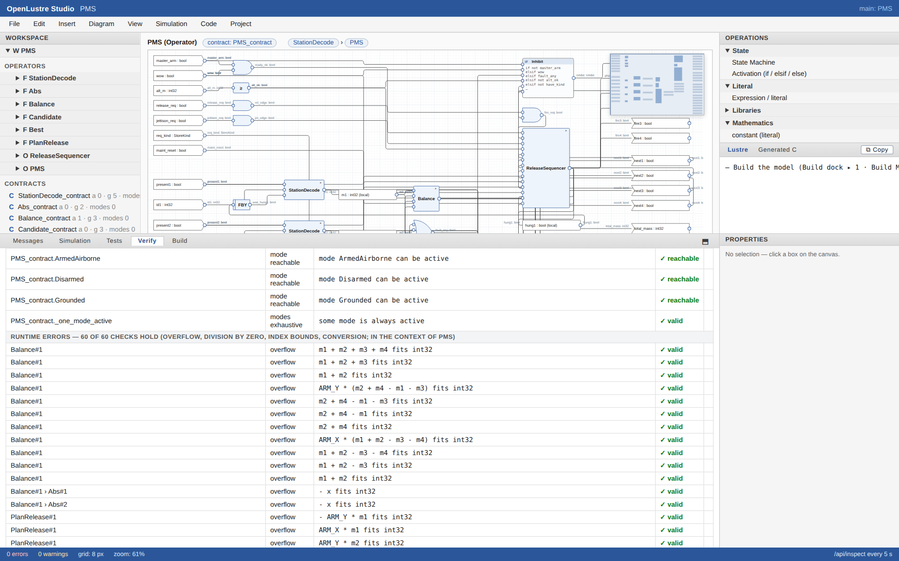
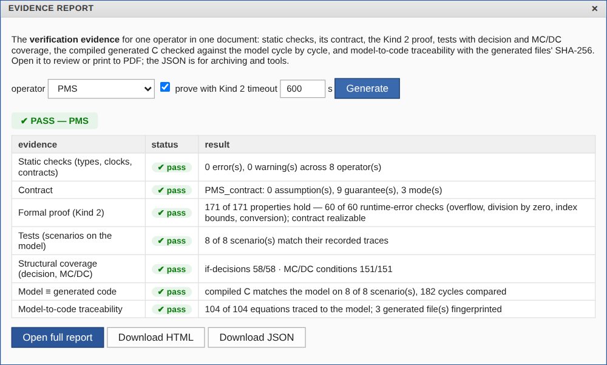

# OpenLustre Studio: a visual capability tour

A tour of the actual Studio interface, using the screenshots already committed
with its example projects. Click an image to inspect its full-resolution file.
These images are **reused captures, not newly captured screens**.

## Capture scope

This gallery was assembled against Studio commit
[`57cfc76`](https://github.com/Shepherdhunt/OpenLustreStudio/tree/57cfc76a870b0a27b1764aa03b6852067375adf5).
The PMS images show the bundled, fixed four-station **100 Hz baseline**. They do
not show the newer 20 Hz timing, aircraft manifests, command records or remaining
inventory work in the separate PMS repository. Counts and green badges belong
only to the model and run pictured; rerun checks for any changed model.

The float integrator and Autopilot-named operators below are illustrative models,
not a demonstrated aircraft autopilot. Studio is a prototyping tool; these
screens do not establish tool qualification, aircraft safety, universal code
equivalence or validated interchange with Ansys SCADE.

## 1. Compose a larger model from reusable operators

**What to notice:** explicit typed connections and reusable operator boundaries;
contracts, enumerated types and shared constants in the project tree. This is a
modeling example of a fixed four-station payload system, not configurable
fleet-wide payload management. [Open the bundled example](../examples/pms).

## 2. State machines and explicit interlocks

**What to notice:** a state machine owned by an operator, guarded transitions and
per-state outputs. The pictured emergency branch is part of this example's
state machine; it is not evidence of preemptive emergency behavior or a
mechanism that can clear a physical jam.

**What to notice:** ordered conditions make the selected inhibition reason
visible. `Clear` is eligibility information, not an acknowledgement that a
particular command was accepted or a payload was delivered.

## 3. Inspect a cycle and its waveforms

**What to notice:** the selected historical cycle drives the diagram values,
state highlights and mode display. The waveform exposes how values change over
time, rather than showing only a final output. This is the illustrative
Autopilot operator, not the PMS load-verification model.

## 4. Run the model and generated C together

**What to notice:** compiled C and model values are compared during this run.
The pictured 10,000-cycle agreement applies to this integrator and these inputs;
it is not a proof that every program or untested input behaves identically.

## 5. Follow a model element into generated code

**What to notice:** an element on the diagram is associated with generated code.
Traceability helps a reviewer find what was emitted; correctness still depends
on the corresponding checks, tests and stated proof scope.

## 6. Review evidence and its limits

**What to notice:** the report distinguishes static checking, contracts, proof,
scenario tests, structural coverage, model/C comparison and traceability.
The displayed PASS belongs to the bundled baseline. New PMS branches have
separate test counts, coverage gaps and proof results; do not carry this badge
forward to them. [Read the bundled example's verification instructions](../examples/pms/README.md#check-test-prove).

For contrast, the [illustrative Autopilot evidence screen](screenshots/11-evidence.png)
shows **PASS WITH GAPS**, making incomplete structural coverage visible rather
than treating every successful check as complete assurance.

## Reproduce and refresh

1. Build or install the exact Studio revision and record it.
2. Record the example's repository, revision, root operator, model fingerprint
   and any relevant timing configuration.
3. Open a disposable copy with `openlustre studio launch PATH_TO_PROJECT`.
4. Build the selected root, run the scenario and (when available) compare
   compiled C. Generate proof/evidence for that exact model if it is pictured.
5. Capture the real interface with readable labels and enough surrounding UI
   to identify the operator, active cycle and result scope. Keep warnings and
   gaps visible. Do not manufacture a green result for presentation.
6. Record screenshot hashes and the actual capture provenance. Distinguish
   new captures from reused images and examples from platform validation.

The [screenshot provenance file](screenshot-provenance.json) identifies the
unaltered image bytes used here and the commits that last changed those files.
Those commits establish repository provenance, not the otherwise unrecorded
capture-time executable version. Fresh screenshots of manifest reconciliation,
command outcomes and inventory accounting should be added only after those
interfaces can be captured and their revision-specific results verified.
