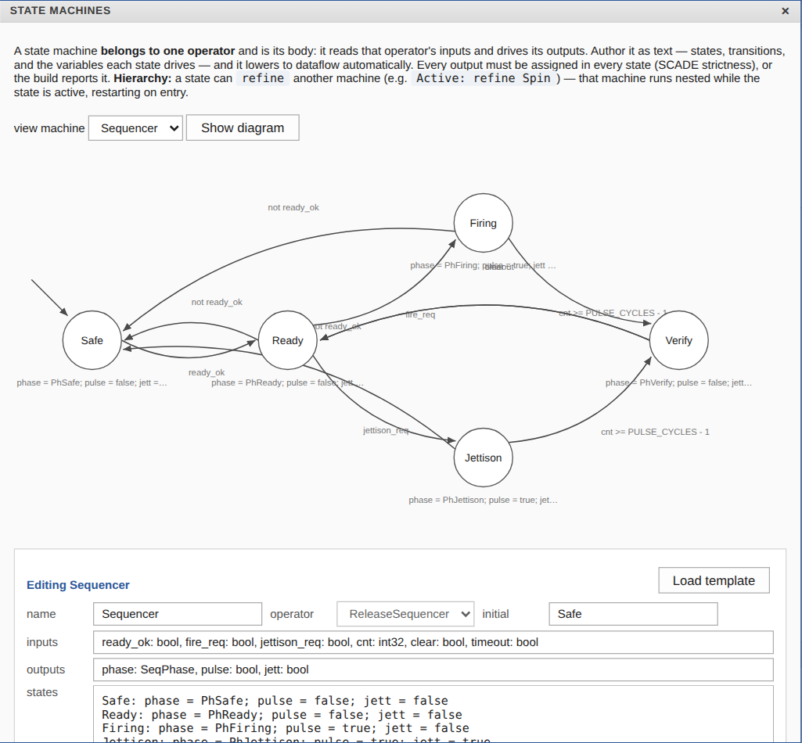
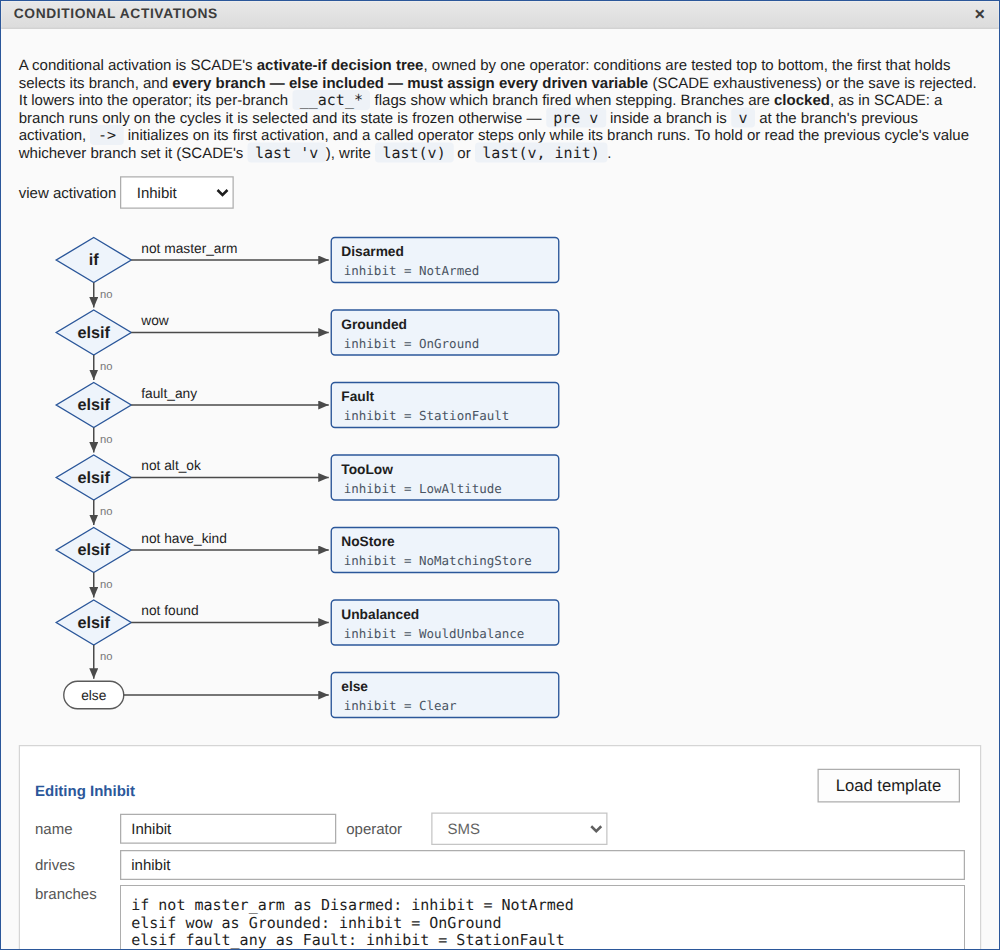

# SMS — a Stores Management System for a drone

A complete OpenLustre Studio project: the stores management system of a
multirotor drone that carries up to four stores (payload items) on release
hooks. It **identifies** what is loaded on each hook, keeps the vehicle
**balanced** as stores leave, and **drops** stores on command, only when
it is safe to. [PLAN.md](PLAN.md) is the specification: requirements with
ids, architecture, verification plan and results.


## Open it

```sh
openlustre studio launch examples/sms
```

| operator | kind | what it does |
|----------|------|--------------|
| `SMS` | root operator | wires it all; owns the **Inhibit** decision tree |
| `StationDecode` | function | tag code → store kind, mass, station status |
| `Balance` | function | total mass, roll and pitch moments, balanced? |
| `PlanRelease` (+ `Candidate`, `Best`, `Abs`) | functions | which hook(s) to open for the requested kind |
| `ReleaseSequencer` | operator | latches the plan, pulses the hooks, catches hung stores; owns the **Sequencer** state machine |

Types (`StoreKind`, `StationStatus`, `SeqPhase`, `Inhibit`) and constants
(station arms, catalogue masses, balance limits, timing) are in
`types.json`. Every operator has a contract whose clause names are the
requirement ids of the plan.





## How it keeps the vehicle balanced

The hooks sit on a 2 × 2 grid around the centre of gravity. The SMS knows
each store's mass from its tag, so it knows the roll and pitch moments of
the loadout. When the operator asks for a kind of item, the planner looks at
every hook holding one and releases the one that leaves the smallest
imbalance within the limits. If no single hook will do, it releases a
lateral pair together (front or rear). If nothing keeps the vehicle
balanced it refuses (`inhibit = WouldUnbalance`), and the operator can drop
something else first. `next1..4` show which hooks the next release would
open. Kind 2 proves that every plan keeps the vehicle within the limits, and
that a plan is found whenever a single safe release exists.

## No runtime errors

The SMS computes masses and moments in `int32` (grams, g·mm). `Prove` also
proves it free of runtime errors (requirement RTE-1): every sum, difference
and product in `Balance`, `PlanRelease` and each of the six `Candidate`
instances fits `int32`, and so does every negation in `Abs` — proved for the
values the stations can actually report, not for any `int32`. The check found
one real defect: the sequencer's phase counter `cnt` counted up forever while
the SMS sat in one phase, and would have overflowed after 2³¹ cycles (about
eight months at 100 Hz). It now saturates at `PULSE_CYCLES + VERIFY_CYCLES`,
above every bound it is compared with, and all 60 checks hold.

## Check, test, prove

```sh
openlustre check examples/sms/sms.wksc
openlustre test run examples/sms/sms.wksc --scenarios examples/sms/scenarios
#   16 passed (8 scenarios on the model and the compiled C); MC/DC 151/151
openlustre kind2 install            # once (Linux/macOS)
openlustre prove examples/sms/sms.wksc --timeout 600
#   prove: 171 of 171 hold
#   prove: runtime errors — 60 of 60 checks hold (overflow, division by zero, bounds, conversion)
openlustre evidence examples/sms/sms.wksc --scenarios examples/sms/scenarios \
    --prove --timeout 600 --out evidence/
#   evidence for `SMS`: PASS
```

| scenario | exercises |
|----------|-----------|
| `inventory_loading` | tags read before stores, unknown tags, masses and moments, pitch-only imbalance, no release on the ground |
| `balanced_release` | a release that keeps balance, one refused as rear-heavy, the order the planner then allows |
| `planner_choice` | the least-imbalance choice (not the lowest hook); a pulse stopped by losing altitude |
| `pair_release`, `rear_pair` | lateral pairs released together |
| `hung_store` | a store that does not leave: latched, skipped, retried by jettison, reset on the ground only |
| `interlocks` | every refusal reason; disarming mid-pulse; a request during a release ignored |
| `jettison` | emergency jettison below the release altitude; losing the arm stops it |


## Files

| path | what |
|------|------|
| `sms.wksc`, `types.json` | the workspace (operators, contracts, state machine, activation, layout; types and constants) |
| `*.lus` | each operator's Lustre, as Build writes it (the prover's view) |
| `scenarios/` | input vectors and recorded golden traces |
| `PLAN.md` | the implementation plan |
| `build/` | how the project was built in the Studio (`build_sms.py` replays it through the editing API from `sms_source.lus`) and how the scenarios were written (`make_scenarios.py`) |
